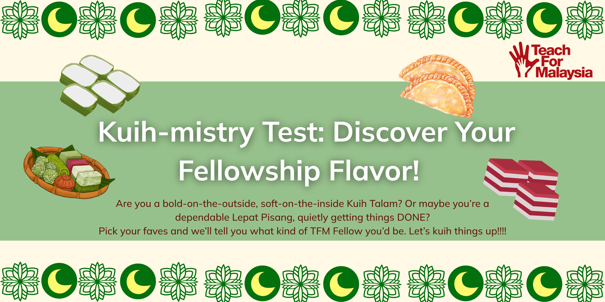

<!DOCTYPE html>
<html lang="en">
<head>
  <meta charset="UTF-8" />
  <meta name="viewport" content="width=device-width, initial-scale=1.0" />
  <title>What Kuih Raya TFM Fellow Are You?</title>
  
</head>
<body>
  

    
    <button class="start-button" onclick="startQuiz()">Start Quiz</button>
  

  

    

      
Loading question...

      

    

    

      <h2 id="result-title"></h2>
      
      

    

  

  
</body>
</html>

